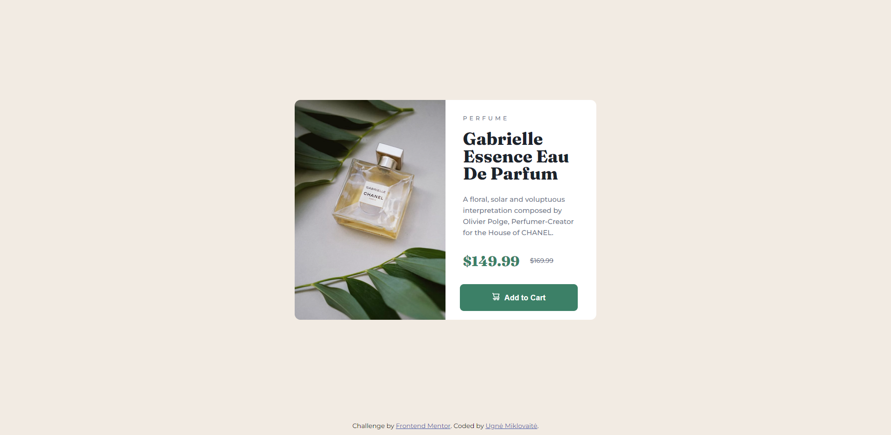
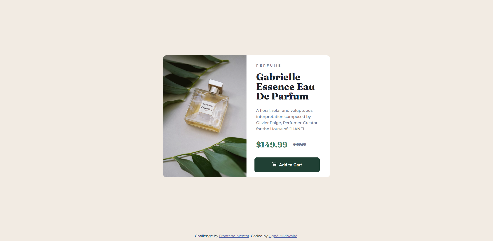

# Frontend Mentor - Product Preview Card Component

This is a responsive product preview card component built with HTML and CSS. The design features a clean and modern layout optimized for desktop and mobile screens. The project was created as part of a Frontend Mentor challenge to practice responsive design, layout techniques, and hover states.

## Features:
- Fully responsive layout using media queries
- Interactive hover states for better user experience
- Clean, modern design with focus on accessibility

## Screenshots:

### Desktop View:

### Mouse Hover View:

### Mobile View:

Feel free to explore the code and suggest any improvements or changes!